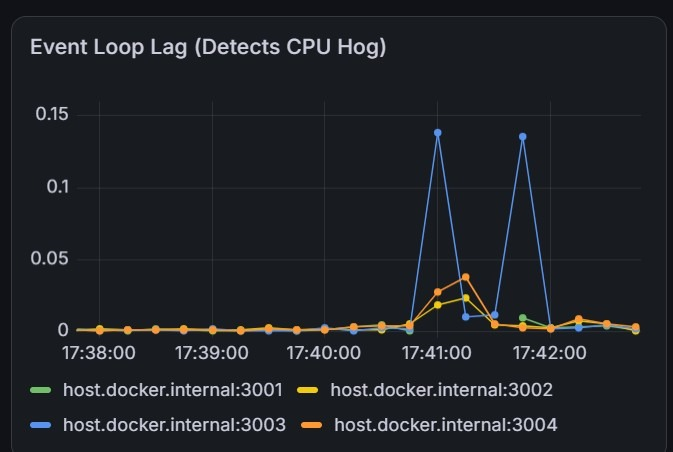
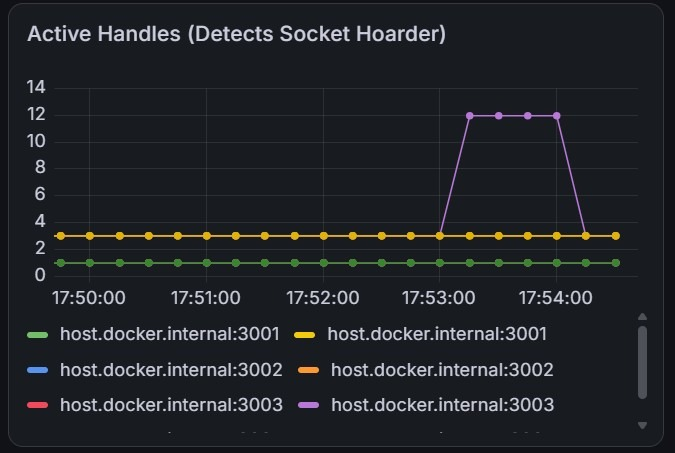
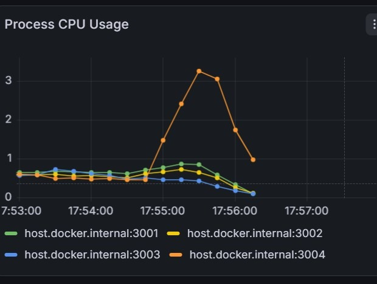
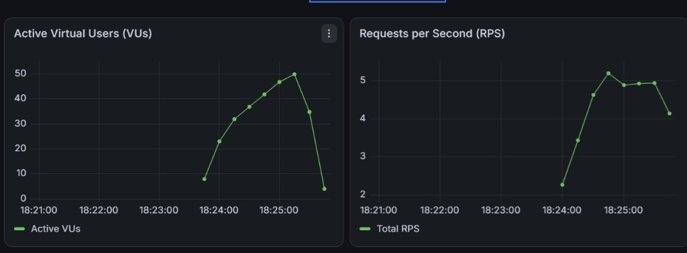
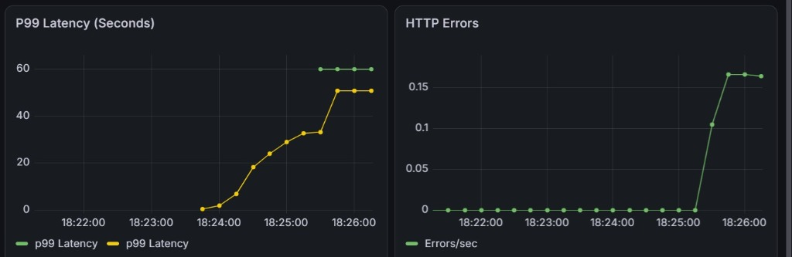
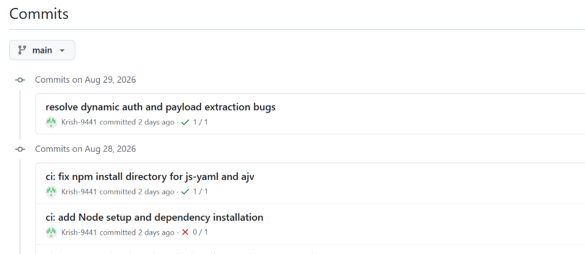

# ⚡ Performance Testing Harness

**A config-driven performance testing tool that generates load, watches your service's vital signs, and tells you — automatically — whether things got better or worse.**

[]()
[]()
[]()
[]()
[]()
[]()


---

## 📖 Table of Contents

- [Problem & Solution](#-problem--solution)
- [Key Features](#-key-features)
- [Architecture](#-architecture)
- [How It Works / Data Flow](#-how-it-works--data-flow)
- [Failure Scenarios](#-failure-scenarios)
- [Tech Stack](#-tech-stack)
- [Project Structure](#-project-structure)
- [Configuration](#-configuration)
- [Quick Start](#-quick-start)
- [Observability & Grafana](#-observability--grafana)
- [Reporting & Baseline Comparison](#-reporting--baseline-comparison)
- [Bring Your Own App](#-bring-your-own-app)
- [CI/CD Integration](#-cicd-integration)
- [Roadmap](#-roadmap)
- [Future Enhancements](#-future-enhancements)

---

## 🎯 Problem & Solution

**The problem:** Performance testing is usually a one-off script someone writes before a big launch, run manually, interpreted by eyeballing a terminal summary, and forgotten until the next incident. There's no repeatable way to say "is this slower than last week?" — and no easy way to see *why* a service is struggling (CPU? memory? a slow downstream dependency? exhausted connections?) rather than just *that* it is.

**The solution:** A self-contained harness that pairs a scriptable load generator (k6) with a real observability stack (Prometheus + Grafana), drives everything from a single human-editable YAML config, and automatically compares every run against a stored baseline — flagging regressions instead of burying them in a wall of numbers. It ships with four intentionally broken Node.js "bad actor" services so you can see each classic failure mode with your own eyes before pointing it at a real application.

---

## ✨ Key Features

- **Scriptable load generation with [k6](https://k6.io/)** — ramp-up, spike, stress, and soak traffic shapes driven entirely by config, not hardcoded scripts
- **Pull-based metrics with [Prometheus](https://prometheus.io/)** — scrapes both the target's internal vitals and k6's client-side experience metrics on the same timeline
- **Provisioned [Grafana](https://grafana.com/) dashboards** — datasources and dashboards defined as version-controlled JSON/YAML, not manual clicking
- **One-command [Docker](https://www.docker.com/) delivery** — the full stack (target, monitoring, load generator) comes up with a single `docker compose up`
- **Config-driven, not code-driven** — a single YAML file defines targets, traffic shapes, payloads, auth, and pass/fail thresholds
- **Automated HTML/Markdown reporting** — every run produces a human-readable summary, not just raw JSON
- **Baseline comparison** — each run is automatically diffed against the last known-good run, with regressions highlighted
- **Built-in failure simulation** — four Node.js "bad actor" microservices reproduce the most common real-world performance incidents on demand
- **CI/CD integration** — a headless test mode designed to run on every pull request and fail the build on regression

---

## 🏗️ Architecture

The harness is three loosely coupled systems that only agree on two shared channels — HTTP traffic and metrics — plus a thin orchestration layer that sequences everything:

1. **Load Generation Engine** (k6) — fires traffic directly at the target, following a config-defined traffic shape
2. **Target System(s)** — the bundled "bad actor" services, or any HTTP application pointed at by config
3. **Monitoring & Observability Layer** (Prometheus + Grafana) — scrapes vitals from the target and experience metrics from k6, then visualizes both on one timeline
4. **Orchestration & Reporting Layer** — starts everything in the right order, waits for completion, and generates the report

The only contract any target system must honor is exposing a `/metrics` endpoint in Prometheus format — everything else about it is a black box to the harness.

```text
 ┌─────────────────────────┐
 │   User-Supplied Config  │
 │ (endpoints, traffic shape,│
 │  payloads, auth tokens) │
 └────────────┬──────────────┘
              │ read at startup
              ▼
 ┌────────────────────────────────────────────────────────┐
 │                   ORCHESTRATION LAYER                  │
 │   (docker-compose / CLI wrapper — starts, sequences,   │
 │     health-checks, tears down, triggers reporting)     │
 └───────┬───────────────────────┬───────────────┬──────────┘
         │ starts                │ starts        │ starts
         ▼                       ▼               ▼
 ┌─────────────────┐     ┌──────────────────┐    ┌───────────────────┐
 │ LOAD GENERATION │     │   TARGET SYSTEM  │    │ MONITORING STACK  │
 │      (k6)       │────▶│ (Node "bad actor"│    │ (Prometheus +     │
 │ fires HTTP load │Flow A│   microservices,│    │    Grafana)       │
 │ per test script │     │  or any BYO app) │    │                   │
 └─────────┬─────────┘     └─────────┬─────────┘    └──────────▲─────────┘
           │                         │ exposes /metrics        │
           │ Flow C: k6 metrics      │ Flow B: scraped         │
           │ (RPS, latency, errors)  │ every N seconds         │
           └──────────────────────────┴──────────────────────────┘
                                 scraped by Prometheus
                                             │
                                             ▼ Flow D: query
                                   ┌──────────────────┐
                                   │      Grafana     │
                                   │ (live dashboards)│
                                   └──────────────────┘
                                             │
                                             ▼ post-run
                                   ┌──────────────────┐
                                   │  Reporting Layer │
                                   │ (HTML/JSON summary,│
                                   │ baseline compare)│
                                   └──────────────────┘
```

---

## 🔄 How It Works / Data Flow

| Flow | Path | Description |
|------|------|-------------|
| **A** | Load Generator → Target | k6 opens direct HTTP/TCP connections to the target — no middleman, so monitoring overhead never skews latency numbers |
| **B** | Target → Monitoring | Prometheus continuously scrapes each target's `/metrics` endpoint at a fixed interval, independent of whether a test is running |
| **C** | Load Generator → Monitoring | k6 exports its own metrics (RPS, latency percentiles, error rate, VUs) to Prometheus, so client-side experience overlays server-side vitals |
| **D** | Prometheus → Grafana | Grafana queries Prometheus only — it never talks to the target or k6 directly, keeping it a pure visualization layer |
| **E** | Orchestrator → Everyone | A lightweight orchestration script starts the stack in order, waits on health checks, kicks off the k6 run, and triggers reporting on exit |


---

## 🧨 Failure Scenarios

Four independently containerized "bad actor" services, each proving a distinct, real-world Node.js failure mode.

### 🔥 CPU Hog
Blocks the Node.js event loop with a naive recursive Fibonacci computation. Since Node has a single thread for JS execution, one bad synchronous handler takes the **entire process** hostage — even unrelated requests like `/health` stall.

> **Expect:** CPU → ~100%, p95/p99 latency climbs sharply, eventual timeouts, process never crashes.

<p align="center">
  <!-- 🖼️ SCREENSHOT PLACEHOLDER -->
  
</p>

### 💧 Memory Leaker
Appends data to a module-level array on every call, which V8's garbage collector can never reclaim. GC time climbs as it fights a losing battle, followed by an out-of-memory kill.

> **Expect:** Slow, steady climb in RSS and heap-used, most dramatic over long soak tests.

<p align="center">
  <!-- 🖼️ SCREENSHOT PLACEHOLDER -->
  
</p>

### 🔌 Socket Hoarder
Holds connections open without responding, or randomly destroys sockets mid-request, exhausting the connection pool. Demonstrates that "up" and "usable" are not the same thing.

> **Expect:** Climbing connection timeouts and resets — distinct from HTTP 5xx errors.

<p align="center">
  <!-- 🖼️ SCREENSHOT PLACEHOLDER -->
  
</p>

### 🐢 Sluggish I/O
Simulates a slow downstream dependency (e.g. an unindexed DB query) with a genuinely async delay. The event loop stays healthy — CPU and event-loop-lag stay flat — but latency still degrades badly under concurrency.

> **Expect:** Flat CPU/event-loop metrics paired with climbing p99 latency — the fingerprint of an external bottleneck, not a broken server.

<p align="center">
  <!-- 🖼️ SCREENSHOT PLACEHOLDER -->
  
</p>

---

## 🛠️ Tech Stack

| Category | Tool |
|---|---|
| Load Generation | [k6](https://k6.io/) |
| Metrics Collection | [Prometheus](https://prometheus.io/) |
| Visualization | [Grafana](https://grafana.com/) |
| Node Metrics Client | [prom-client](https://github.com/siimon/prom-client) |
| Containerization | [Docker](https://www.docker.com/) |
| Local Orchestration | [Docker Compose](https://docs.docker.com/compose/) |
| Config Format | YAML + JSON Schema validation |
| CI/CD | GitHub Actions |
| Dummy Servers | Express / Fastify |
| Reporting | Node.js scripting + HTML templating |

---

## 📁 Project Structure

```
performance-testing-harness/
├── docker-compose.yml          # Master orchestration file
├── config/                     # User-facing YAML configs + JSON Schema
│   ├── schema/
│   └── examples/
├── harness/                    # The reusable tool itself
│   ├── cli/                    # Orchestrator CLI
│   ├── load-generation/        # k6 scripts + scenario templates
│   ├── monitoring/             # Prometheus + Grafana provisioning
│   ├── reporting/               # Report generation + baseline store
│   └── docker/                 # Dockerfiles for stack components
├── dummy-servers/               # The "bad actor" test subjects
│   ├── cpu-hog/
│   ├── memory-leaker/
│   ├── socket-hoarder/
│   └── sluggish-io/
├── ci/                          # GitHub Actions + headless CI scripts
├── docs/                        # Architecture, config reference, images
└── scripts/                     # setup / teardown / seed-baseline
```

`harness/` and `dummy-servers/` live as siblings by design — the harness must keep working even if the dummy servers are deleted and swapped for a pointer to a real application.

---

## ⚙️ Configuration

Everything the harness runs is driven by a single YAML file — no source code edits required to change what's under test.

```yaml
target:
  baseUrl: http://cpu-hog:3000
  environment: local
  headers:
    Content-Type: application/json

scenarios:
  - name: fibonacci-stress
    endpoint:
      path: /fibonacci
      method: GET
    trafficShape:
      type: stress
      stages:
        - duration: 30s
          target: 10
        - duration: 1m
          target: 100
    weight: 100

auth:
  type: bearer
  token: ${API_TOKEN}

thresholds:
  p95Latency: 500ms
  errorRate: 1%
```

Configs are validated against `config/schema/harness-config.schema.json` at startup, with clear, specific errors for anything malformed.

---

## 🚀 Quick Start

```bash
# 1. Clone the repo
git clone https://github.com/your-org/performance-testing-harness.git
cd performance-testing-harness

# 2. Configure
cp .env.example .env
cp config/examples/smoke-test.yml config/active-config.yaml
# edit config/active-config.yaml to point at your target

# 3. Bring up the stack
./harness.sh up

# 4. Run a test
./harness.sh test

# Dashboards: http://localhost:3000 (Grafana)
# Metrics:    http://localhost:9090 (Prometheus)
```

A generated report will be written to `harness/reporting/` once the run completes.

---

## 📊 Observability & Grafana

Live dashboards overlay **what the server was doing internally** (CPU, memory, event loop lag, GC pauses) with **what the client experienced** (RPS, latency percentiles, error rate) on the same timeline — provisioned as code so every environment looks the same.

### Load Test Overview (k6)
This dashboard provides a real-time, client-side view of the load test in progress. It visualizes the total active Virtual Users (VUs), Requests per Second (RPS), p99 Latency, and HTTP error rates directly exported from the k6 engine.

<p align="center">
  
</p>

<p align="center">
  
</p>


---

## 📈 Reporting & Baseline Comparison

Every run produces a human-readable report summarizing p50/p95/p99 latency, error rate, and peak resource usage — and automatically diffs those numbers against the last known-good baseline, flagging any regression beyond a configurable threshold.

<p align="center">
  <a href="https://onecompiler.com/html/44zs3fe9x" target="_blank">
    <strong>📄 View Generated HTML Report</strong>
  </a>
</p>

<p align="center">
  <a href="https://onecompiler.com/html/44zs4eb7t" target="_blank">
    <strong>📈 View Baseline Comparison Report</strong>
  </a>
</p>

---

## 🔌 Bring Your Own App

The harness has no hardcoded knowledge of the dummy servers — swapping the target is purely a matter of changing `target.baseUrl` and the scenario `endpoint` values in your config. The config schema only speaks in generic HTTP and performance concepts (URLs, methods, headers, payloads, traffic shapes, thresholds), so it works identically against:

- The bundled Node.js "bad actor" fleet
- A staging or pre-prod environment
- Any arbitrary third-party or internal HTTP API

Authentication (static bearer/API key, or a login-flow token exchange) is configured once under the `auth` section and applied automatically to every scenario — no per-endpoint wiring needed.

---

## 🔁 CI/CD Integration

A headless CI mode runs the harness with no interactive dashboards, uses shorter/lighter traffic profiles suited to CI runners, and exits non-zero if the baseline comparison flags a regression — turning performance testing into a routine PR check rather than a manual chore.

<p align="center">
  
</p>

---

## 🗺️ Roadmap

- [x] **Phase 0** — Foundations & environment setup
- [x] **Phase 1** — Build the dummy "bad actor" fleet
- [x] **Phase 2** — Stand up the monitoring layer (Prometheus + Grafana)
- [x] **Phase 3** — Introduce the load generation engine (k6)
- [x] **Phase 4** — Orchestration layer (single-command startup)
- [x] **Phase 5** — Configuration-driven testing (YAML + schema)
- [x] **Phase 6** — Reporting & baseline comparison
- [x] **Phase 7** — "Bring Your Own App" generalization
- [x] **Phase 8** — CI/CD integration
- [x] **Phase 9** — Polish, packaging & v1.0.0 release

See `docs/architecture.md` for the full phase-by-phase design rationale.

---

## 🔮 Future Enhancements

- Kubernetes-based orchestration for multi-node / distributed load generation
- Pluggable alerting (Slack/PagerDuty) on threshold breaches during a live run
- Additional bad-actor scenarios (thread-pool exhaustion, DNS latency, TLS handshake overhead)
- A hosted historical-trends view across many runs, beyond single-baseline comparison
- Support for gRPC and WebSocket targets, not just HTTP
